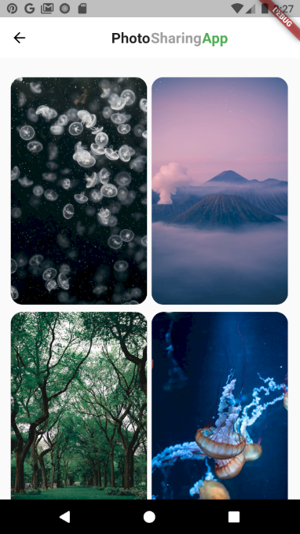

# PhotoSharingApp

> A Flutter app that helps you to view and download free photos on the internet.

## Description

Image data taken from https://www.pexels.com/api/ API. 

## Screenshots

<<<<<<< HEAD
  
  
  
  
  
=======
  
  
  
  
  
>>>>>>> fdad8f22f3f58712aa15ed9369ba9b3f31f502ea

