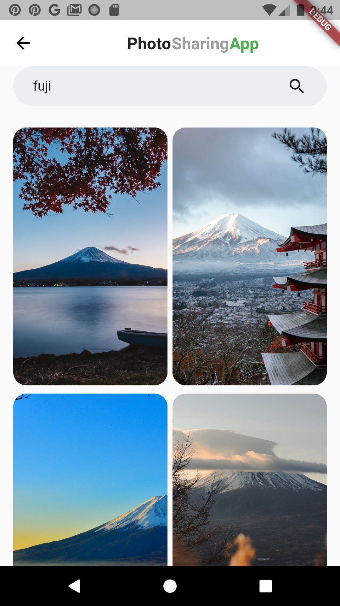
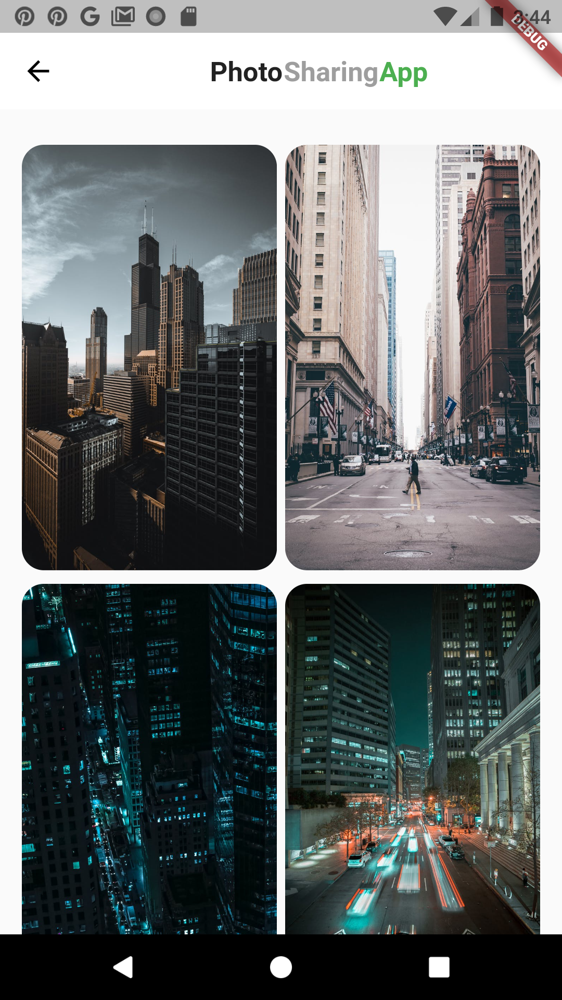

# PhotoSharingApp

> A Flutter app that helps you to view and download free photos on the internet.

## Description

Image data taken from https://www.pexels.com/api/ API. 

## Screenshots

  
  
  
  
  

